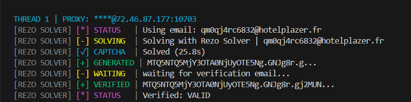

# ⚡ Rezo Discord Gen — Discord Account Generator

<div align="center">
  
  
  
  
</div>

---

## 🚀 Overview

**Rezo Discord Gen** is a state-of-the-art Discord account generator designed for speed, reliability, and maximum bypass efficiency. It leverages high-performance request-based registration and seamless integration with **Rezo Solver** to handle hCaptcha challenges automatically.

This project is built for professional-grade automation, handling everything from fingerprinting and TLS impersonation to automated email verification.

## ✨ Key Features

- **🔥 hCaptcha Bypass:** Native integration with Rezo Solver for lightning-fast hCaptcha solving.
- **⚡ Multi-Threaded:** High-performance asynchronous generation with customizable thread counts.
- **📧 Auto Email Verification:** Integrated with Cybertemp API for instant email verification and token extraction.
- **🌐 Proxy Support:** Advanced proxy management with session stickiness and rotation support (supports `usr:pwd@ip:port` format).
- **📊 Live Statistics:** Real-time console title updates and logging for success rates, captcha solve times, and token status.

## 🛠️ Installation

### Prerequisites
- Python 3.9+
- A high-quality proxy provider (Residential/ISP recommended)

### Setup
1. Clone the repository
   ```bash
   git clone https://github.com/RezoSolver/Rezo-Gen.git
3. Install dependencies:
   ```bash
   pip install -r requirements
   ```

4. Configure your keys in `/input/config.json`:
```json
  {
    "data": {
      "solver_api_key": "YOUR_REZO_SOLVER_KEY"
    },
    "mail": {
      "api_key": "YOUR_FREECUSTOM_EMAIL_API_KEY"
    },
    "verification": {
      "enabled": true
    }
  }
  ```

5. Add your proxies to `/input/proxies.txt` (format: `user:pass@host:port`).

## 📖 Usage

Navigate to the generator directory and run:

```bash
cd Rezo-Gen
python main.py
```

Follow the prompts to set your thread count and watch the magic happen.

## 📸 Screenshots


## 🧠 The Tech Stack

- **`stealth_requests`**: Enhanced session handling for maximum anonymity and fingerprint consistency.
- **`Rezo Solver`**: High-speed hCaptcha solving API.
- **`colorama` & `pystyle`**: Professional UI and logging.

## 🧩 Powered by Rezo Solver

**Rezo Discord Gen** natively uses [Rezo Solver](http://huzaif.online), the absolute best and highest-speed hCaptcha solver on the market. It guarantees unmatched unlock rates and token stability seamlessly.

### 🔗 Official Links

- **Rezo Solver**: [http://huzaif.online](http://huzaif.online)
- **Discord Server**: [https://discord.gg/g3Eqhn8wTb](https://discord.gg/g3Eqhn8wTb)
- **Token Store**: [https://rezotokens.mysellauth.com/](https://rezotokens.mysellauth.com/)
- **GitHub**: [https://github.com/RezoSolver](https://github.com/RezoSolver)

## 👥 Developers

● Huzaif

● Lucid


## ⚠️ Disclaimer

This project is for educational and research purposes only. The authors are not responsible for any misuse of this software. Please respect Discord's Terms of Service.

<div align="center">
  Developed with ❤️ by Rezo Solver
</div>
